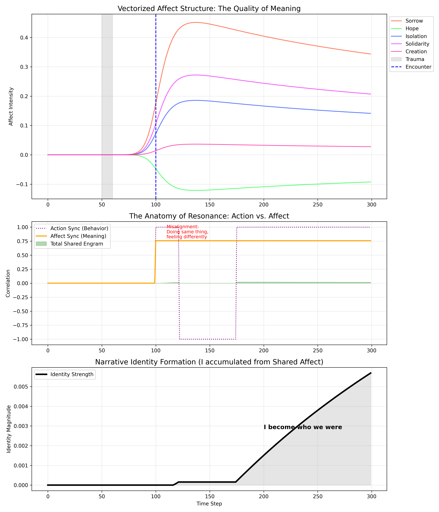

# Affective_SIA

**Generative Identity: Self-Imprint Attribution (SIA) Model**

A Computational Framework for Identity Formation via Shared Affective Resonance.

## Abstract

This repository contains the reference implementation of the **Self-Imprint Attribution (SIA)** theory. Unlike traditional Reinforcement Learning or Active Inference models which treat prediction errors as costs to be minimized, SIA posits that identity is formed by attributing, imprinting, and sharing these errors as "affective meanings."

The core hypothesis is that subjective pain (Trace) evolves into meaning (Affect), drives world-modifying behavior (Action), and—only when synchronized with another mind—emerges as a Narrative Identity.

📄 **Read the Paper (Draft):** [Affective_SIA_preprint.pdf](./docs/paper/Affective_SIA_preprint.pdf)


*Figure: The emergence of narrative identity through shared affective resonance.*

## Repository Structure

The project is organized to separate the core theoretical logic from specific experimental scenarios.

```text
Affective_SIA/
├── affective_sia/                 # Core Library Package
│   ├── __init__.py
│   ├── agents.py                  # Agent definitions (Identity_SIA_Agent)
│   ├── config.py                  # Simulation parameters
│   ├── core.py                    # Mathematical functions
│   └── visualization.py           # Plotting logic
│
├── docs/                          # Documentation
│   ├── experiments/               # Experiment descriptions
│   │   ├── 01_passive_adaptation.md
│   │   ├── 02_creative_action.md
│   │   ├── 03_interpersonal_resonance.md
│   │   ├── 04_active_agency.md
│   │   ├── 05_identity_formation.md
│   │   └── 06_parameter_sweep.md
│   └── paper/                     # LaTeX source
│       └── Affective_SIA_arXiv_Template.tex
│
├── experiments/                   # Reproducible Scripts
│   ├── 01_passive_adaptation.py
│   ├── 02_creative_action.py
│   ├── 03_interpersonal_resonance.py
│   ├── 04_active_agency.py
│   ├── 05_identity_formation.py
│   └── 06_parameter_sweep.py
│
├── results/                       # Simulation Outputs
│   └── figures/                   # Generated plots
│       ├── active_agency.png
│       ├── creative_action.png
│       ├── identity_formation.png
│       ├── interpersonal_resonance.png
│       ├── passive_adaptation.png
│       └── sensitivity_analysis.png
│
├── LICENSE
├── README.md
├── requirements.txt
└── setup.py

```

## Installation

1. Clone the repository:
   ```bash
   git clone [https://github.com/rysawaki/Affective_SIA.git](https://github.com/rysawaki/Affective_SIA.git)
   cd Affective_SIA
   ```

2. Install dependencies:
   ```bash
   pip install -r requirements.txt .
   ```
   *(Requires `numpy` and `matplotlib`)*

## Usage

### Running the Full Model (Identity Formation)
To reproduce the main results of the paper (Narrative Identity Formation via Shared Resonance), run the final experiment script:

```bash
python experiments/05_identity_formation.py
```

This will generate the simulation plots in a window (or save them if configured).

### Configuring Parameters
You can modify simulation parameters (e.g., learning rates, sensitivity, steps) without changing the code by editing `affective_sia/config.py`:

```python
# affective_sia/config.py
@dataclass
class SimulationConfig:
    steps: int = 300
    alpha_trace: float = 1.0  # Sensitivity to trace
    # ...
```

## Core Theory

The model operates on a cycle of five phases:

1.  **Trace ($T$):** Physical accumulation of discrepancy (Trauma/Shock).
2.  **Attribution ($P_{self}$):** The gate of ownership. $P(Self|E) \propto Agency + Trace$.
3.  **Affect ($A$):** Vectorized meaning (e.g., Sorrow, Creation) generated from Traces.
4.  **Action ($Act$):** Creative intervention to resolve internal Affect.
5.  **Identity ($I$):** The integral of shared affective history.

### Key Equation: Identity Integration

Identity is defined not as a static attribute, but as the time-integral of shared affective resonance:

$$I(t) = \int_{0}^{t} \text{Shared}(\tau) \cdot A(\tau) \, d\tau$$

Where $\text{Shared}(t)$ is non-zero only when both action and affect are synchronized between agents.

## License

MIT License. See [LICENSE](LICENSE) file for details.
