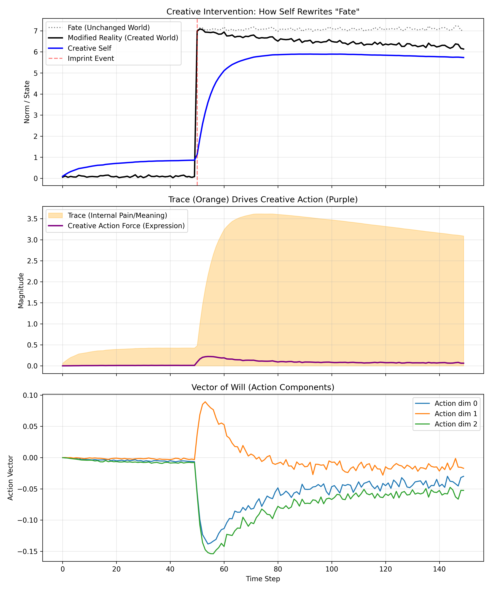

# Experiment 02: Trace-Driven Creative Action

This experiment marks the transition from **"Passive Adaptation"** to **"Active Creation."** It introduces the core concept of the SIA model: that internal pain (Trace) is not merely a cost to be minimized, but a source of energy that drives the agent to modify its environment.

## 1. Experimental Setup

* **Scenario:** Similar to Experiment 01, a traumatic event occurs at `t=50`. However, the agent is no longer a passive observer. It possesses the ability to act upon the world.
* **World Dynamics:** The world has "Inertia" (resistance to change). It follows a predetermined path ("Fate") unless acted upon by the agent.
    $$W_{t+1} = \text{Inertia} \cdot W_t + (1 - \text{Inertia}) \cdot (W_t + \text{Action}_t)$$

## 2. Agent Model: The Creative SIA Agent

The agent operates on a perception-action loop where **Trace ($T$)** serves as the motivational force for **Action ($A$)**.

### Key Mechanisms

**1. Creative Drive (Energy Source):**
Unlike standard reinforcement learning where action is driven by reward maximization, SIA postulates that action is driven by the need to externalize internal traces. The magnitude of the creative drive is proportional to the accumulated trace.
$$E_{creation} \propto ||T||$$
* **implication:** An agent with no scars (no Trace) has no motivation to create or change the world.

**2. The Vector of Will (Action Direction):**
The agent attempts to resolve the discrepancy not just by changing itself (adaptation), but by pulling the world closer to its own internal state ($S$).
$$\vec{A} = k \cdot E_{creation} \cdot (S - W)$$
* This represents the "projection" of the self onto the world—the essence of artistic or expressive acts.

## 3. Results & Analysis

The simulation results demonstrate three critical dynamics:

1.  **Rewriting "Fate" (Top Panel):**
    * **Dotted Line:** The "Fate" scenario (world trajectory without agent intervention).
    * **Solid Line:** The "Modified Reality" created by the agent's actions.
    * The deviation between these lines represents the agent's impact on the world. The agent has successfully bent reality to align closer to its internal state.

2.  **From Suffering to Creation (Middle Panel):**
    * Observe the timing: The **Trace (Orange area)** accumulates first immediately after the shock.
    * The **Action (Purple line)** follows the Trace.
    * This confirms the hypothesis: **"Trace precedes and drives Action."** The action persists as long as the trace remains, acting as a mechanism for healing through expression.

3.  **Vector of Will (Bottom Panel):**
    * The agent actively intervenes in specific dimensions where the discrepancy is largest, effectively "repairing" the world structure to restore stability.

## 4. Conclusion

This experiment validates the **Active Inference** component of the SIA model. It shows that "Trauma" (Trace) functions as a potential energy for "Creation" (World Modification). The agent transforms from a victim of circumstance into an author of its own reality.