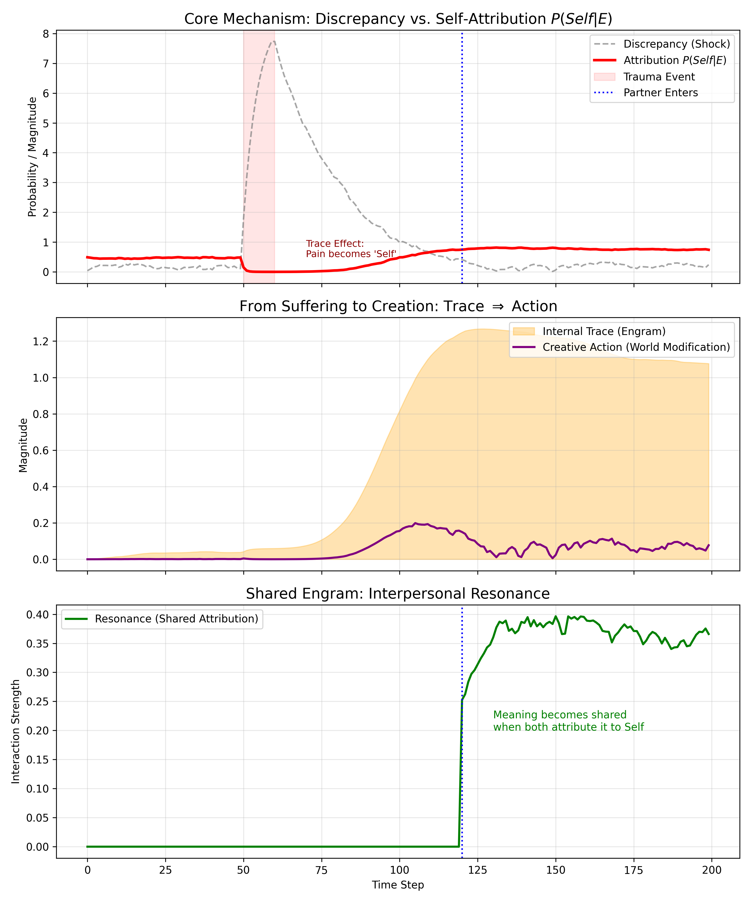

# Experiment 03: Interpersonal Resonance & The Attribution Gate

This experiment establishes the social foundation of the SIA model. It moves beyond the single-agent perspective to demonstrate how subjective "Trace" becomes objective "Meaning" through interpersonal synchronization, a phenomenon we term **Shared Engram**.

## 1. Experimental Setup

* **Scenario:** An agent ("Protagonist") undergoes a traumatic event at `t=50`. Later, at `t=120`, a second agent ("Partner") enters the environment.
* **Interaction:** The agents interact not merely by exchanging data, but by influencing each other's perception of the world.
* **Goal:** To observe the conditions under which a "Shared Engram" (green zone) emerges from individual attribution processes.

## 2. Key Mechanisms

### A. The Attribution Gate (Core Equation)
The SIA model posits that not all experiences are internalized. Only experiences that pass through the **Attribution Gate** become part of the self.

$$P(Self|E) = \sigma( -\|E - S\| + \alpha \|T\| )$$

* **Discrepancy ($-\|E - S\|$):** A large prediction error (Surprisal) initially reduces self-attribution, leading to **Dissociation** ("This is not me").
* **Trace Gravity ($+\alpha \|T\|$):** However, accumulated traces exert a gravitational pull, forcing the agent to accept the experience. This mathematical term embodies the concept: **"Pain becomes Self."**

### B. Shared Engram (Resonance)
Meaning is defined as "shared" only when both interacting agents simultaneously attribute the current interaction to their respective selves.

$$\text{Resonance}(t) = P_{self}^{(1)}(t) \cdot P_{self}^{(2)}(t) \cdot \text{InteractionStrength}$$

This implies that **mutual vulnerability** (high $P_{self}$) is a prerequisite for deep connection. If one agent dissociates ($P \approx 0$), no shared engram can be formed regardless of the other's intent.

## 3. Results & Analysis

