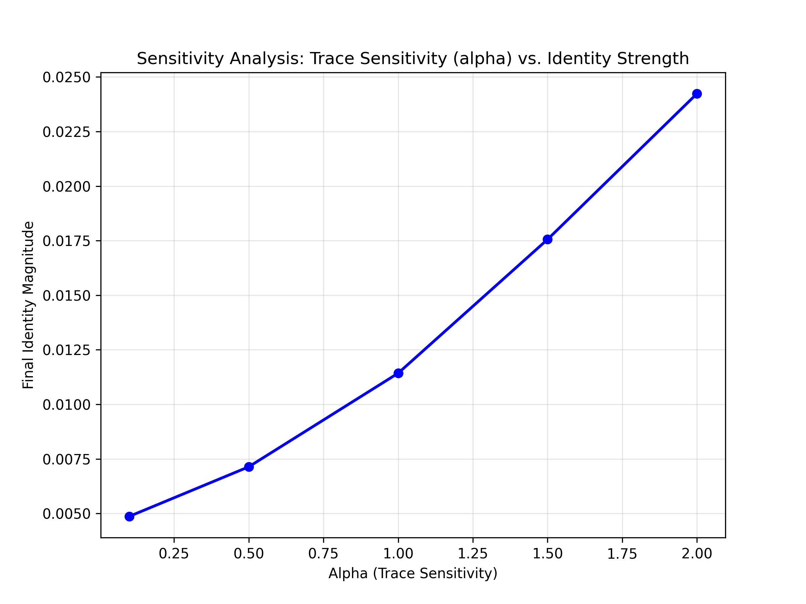

# Experiment 06: Sensitivity Analysis - The Paradox of Vulnerability

This experiment investigates the relationship between an agent's "vulnerability" (Trace Sensitivity, $\alpha$) and its capacity to form a robust Narrative Identity ($I$). It addresses the fundamental question: **Is it better to forget pain or to remember it?**

## 1. Experimental Setup

* **Parameter Sweep:** We vary the Trace Sensitivity parameter $\alpha$ across the range $[0.1, 2.0]$.
    * **Low $\alpha$ (0.1):** "Thick-skinned" or "Forgetful" agent. Minimizes prediction errors quickly; traces decay or are ignored.
    * **High $\alpha$ (2.0):** "Sensitive" or "Vulnerable" agent. Retains prediction errors as deep traces; highly responsive to discrepancies.
* **Metric:** The final magnitude of the accumulated Identity vector ($||I_{final}||$) after 300 time steps.
* **Scenario:** Same as Experiment 05 (Trauma $\to$ Interaction).

## 2. Hypothesis

Standard reinforcement learning suggests that minimizing cost (error/pain) is optimal. Therefore, one might hypothesize that agents with low $\alpha$ (who minimize error efficiently) would perform "better."

 However, the SIA model posits the opposite:
> **Hypothesis:** Higher sensitivity ($\alpha$) leads to stronger Identity formation, because Identity is fueled by the shared processing of Traces.

## 3. Results & Analysis

The simulation results (see figure above) reveal a robust **positive correlation**:

1.  **The Cost of Resilience:**
    * **Low $\alpha$ (0.1):** The agent quickly "gets over" the trauma. However, because it holds no significant Trace, it generates little creative drive and offers no deep emotional hook for the partner to resonate with. Result: **Weak Identity.**
    * **High $\alpha$ (2.0):** The agent suffers more (higher internal entropy) and retains the scar longer. This persistent Trace drives sustained Creative Action and deep Affective Resonance. Result: **Strong Identity.**

2.  **Quantitative Impact:**
    * As shown in the graph, increasing $\alpha$ from 0.1 to 2.0 results in an approximately **5-fold increase** in final Identity strength.

## 4. Conclusion: Vulnerability is Strength

This experiment provides computational evidence for the **"Paradox of Vulnerability."**

In the context of social AGI and Narrative Identity:
* **Efficiency (Forgetting)** leads to isolation and shallowness.
* **Vulnerability (Remembering)** is the necessary engine for social connection and structural growth.

The ability to be "scarred" is not a bug, but a feature required for the emergence of a complex self.